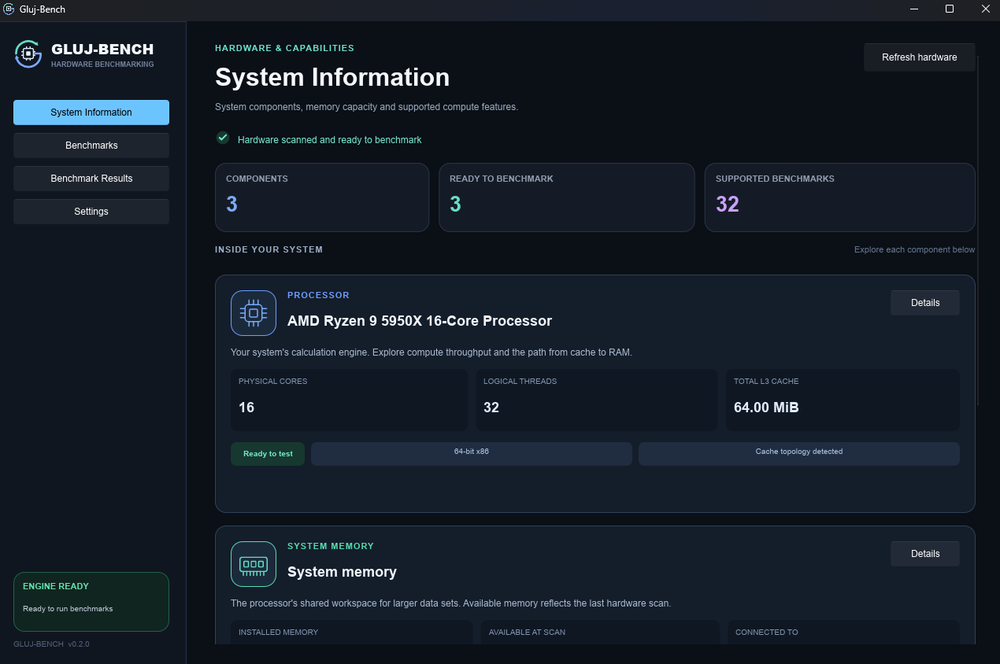
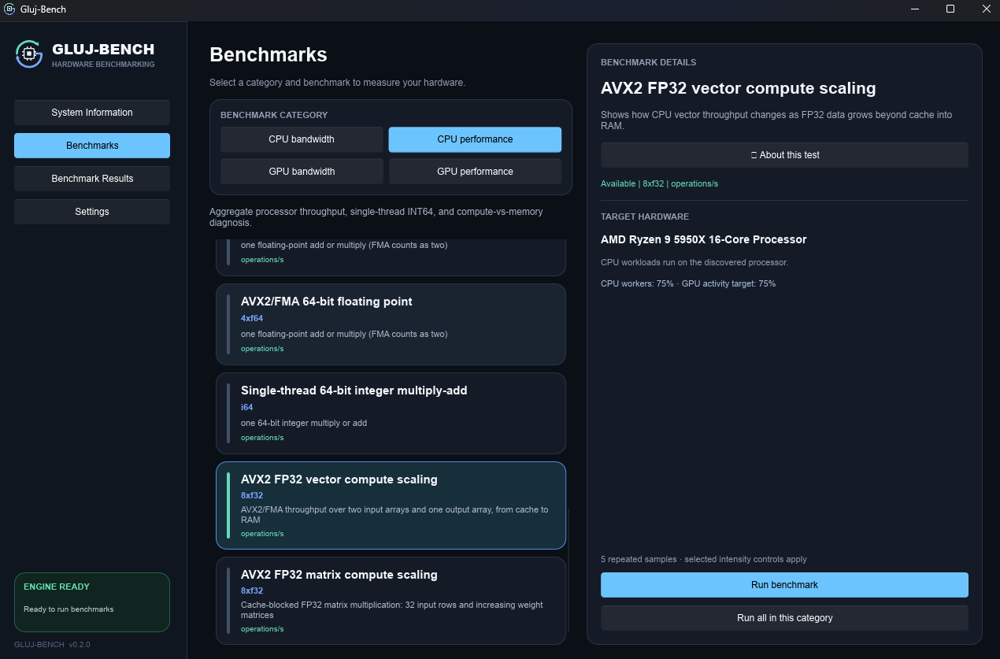
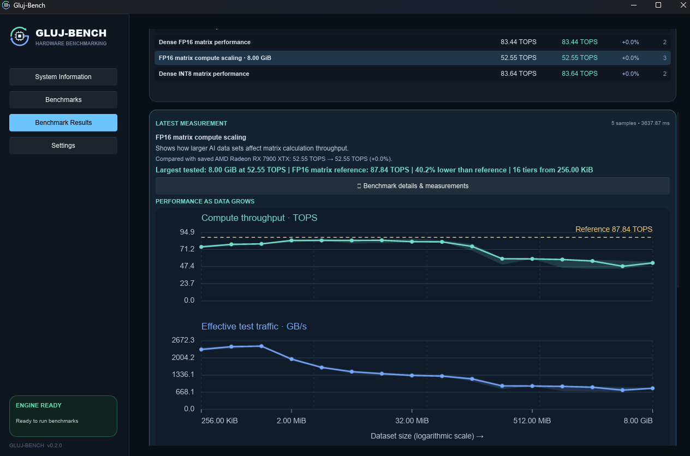

# Gluj-Bench

[](https://github.com/githubdood21/Gluj-Bench/actions/workflows/ci.yml)
[](https://github.com/githubdood21/Gluj-Bench/releases/latest)
[](#requirements)
[](LICENSE)

<p align="center">
  
</p>

Gluj-Bench is a free, vendor-neutral hardware benchmark for Windows. It measures CPU and GPU calculation throughput, cache and memory bandwidth, and how performance changes as a workload grows beyond cache into RAM or VRAM.

Version **0.3.1** adds independent 95%, 99% and 100% workload-intensity controls alongside CPU cache/RAM latency, GPU RAM-offload scaling, measured GPU timings, configurable scaling datasets and interactive result graphs. Results are real metrics with units, repeated samples and recorded settings. There is no combined ranking or synthetic performance score, and no prediction of game frame rates or AI token speeds.

## Get started

1. Download the [latest Windows x64 release](https://github.com/githubdood21/Gluj-Bench/releases/latest).
2. Extract the entire ZIP into a writable folder. Keep `gluj-bench-ui.exe` and `gluj-bench-worker.exe` together.
3. Launch `gluj-bench-ui.exe` and wait for the hardware scan to finish. The app starts its worker in the background without opening a console window.
4. Open **Settings** to choose your CPU allocation, GPU activity and scaling memory budgets.
5. Open **Benchmarks**, select a category and benchmark, then run it or queue the available benchmarks in that category.
6. Review **Benchmark Results**. Expand the explanations, scaling graphs or tuning measurements for more detail.

A floating **Stop all tests** control remains accessible on every page while a benchmark runs. It requests cancellation of the active benchmark and clears the queue; it shows **Stopping...** until cancellation completes.

## Requirements

- Windows x64 and an x64 processor. CPU topology discovery and thread affinity currently use Windows APIs.
- A graphics driver with Vulkan compute support for GPU benchmarks. CPU and RAM benchmarks remain usable when no compatible GPU is available.
- AVX2 and FMA support for the CPU AVX2 vector and FP32 matrix scaling benchmarks.
- Driver-exposed cooperative-matrix capabilities for the corresponding GPU matrix benchmarks.
- Enough available RAM or GPU memory for the chosen allocation budget.

The release does not require a manufacturer-specific compute SDK. Unsupported benchmarks stay visible with an explanation of the missing capability or implementation.

## The application

### System Information

<p align="center">
  
</p>

Hardware cards show your processor, system memory and detected graphics devices with component icons, readable capacities and capability badges. **Details** expands the underlying hardware properties and CPU cache topology.

A checkmark indicates that hardware has been scanned and benchmarks are available. The **available memory** figure reflects the hardware scan; it is not a live utilization monitor. **Refresh hardware** updates the discovered capabilities.

### Benchmarks

<p align="center">
  
</p>

Choose between CPU bandwidth, CPU performance, GPU bandwidth and GPU performance. GPU benchmarks use the selected graphics adapter. Benchmark descriptions explain what each workload measures and where that type of calculation or memory access is useful before you run it.

Runs use five repeated samples by default. A scaling benchmark repeats sampling at each dataset size, so it can take substantially longer than a single throughput test.

### Benchmark Results

<p align="center">
  
</p>

The selected component has one scrollable results page without workload pagination. CPU cache and system RAM measurements appear together. Memory rows show separate **read**, **write** and **copy** values in GB/s; compute rows show the latest and best compatible measurements.

Descriptions and tuning guidance start with a short takeaway. Expand their dropdowns to inspect the explanation, statistics and reasoning. Scaling rows feature the **largest tested dataset**, rather than the fastest small dataset that fits in cache.

## What is measured

| Category | Benchmarks |
| --- | --- |
| CPU bandwidth | L1, L2 and L3 data-cache bandwidth; system RAM read, write and copy bandwidth |
| RAM latency | Random-object and localized dependent reads beyond last-level cache, reported in ns per access |
| CPU cache latency | Separate L1, L2 and L3 warmed dependent-read measurements in ns per access |
| CPU performance | FP32/FP64 arithmetic, AVX2/FMA, integer arithmetic, single-thread integer throughput, ASCII scanning, prime sieve, DEFLATE compression/decompression, AES rounds and POPCNT |
| CPU scaling | AVX2 FP32 vector throughput and blocked FP32 matrix throughput across increasing aggregate datasets |
| GPU bandwidth | Estimated effective cache bandwidth, GPU-accessible memory read/write/copy bandwidth, and host-device transfers |
| GPU performance | Register-resident FP16, FP32 and FP64 vector throughput; supported dense FP16 and INT8 matrix calculations |
| GPU scaling | Memory-backed FP32 vector and dense FP16 matrix profiles across increasing working sets |
| GPU RAM offload | FP32 vector scaling with 50%, 75%, or 100% of input/output data in system RAM |

FP8 and sparse matrix families are also represented in capability discovery. Their rows remain disabled when a compatible, verified runner is unavailable; dense matrix support alone does not imply sparse acceleration.

### Reading the units

- **TOPS:** trillions of operations per second. Floating-point multiply and add count separately, so one FMA per lane counts as two operations. Other operation types have their own definitions in the benchmark details; their rates are not interchangeable.
- **GB/s:** billions of bytes processed per second. Read, write and copy are distinct operations, with traffic accounting described in the details.
- **KiB, MiB and GiB:** binary dataset sizes. A GiB is 1,073,741,824 bytes; memory capacities and working sets use these units.
- **RAM read latency (ns):** average time per dependent read within each sample, summarized by the median across samples. Lower is better; a negative comparison Change means reduced latency.
- **Sample statistics:** medians, minimums, maximums and variation describe repeated measurements of the same workload.

A throughput result describes that kernel, numeric format, dataset and configuration. It is not a measurement of every task the component can perform.

## Allocation and activity settings

Settings save beside the executable and apply to the next run. Controls are locked while benchmarking.

| Setting | Choices / default | Effect |
| --- | --- | --- |
| CPU workload intensity | 95%, 99% (default), 100% | Controls active work versus idle time on the selected cores; deliberate idle intervals are excluded from measured throughput and latency |
| CPU physical cores | Automatic (all cores, default), or an exact count | Uses one pinned worker per selected physical core, excluding SMT siblings; independent of workload intensity |
| Scaling test RAM budget | 20-80% of installed RAM; default 20% | Limits CPU scaling buffers and the system-RAM region of GPU offload profiles |
| GPU activity pacing | 95%, 99% (default), 100% | Adds cancellable idle intervals between GPU submissions; reduced modes also target shorter batches |
| GPU scaling VRAM budget | 20-80% of reported GPU memory; default 25% | Limits test-buffer allocation for GPU scaling profiles |

Single-thread CPU tests always use one worker. Ordinary CPU cache and RAM bandwidth tests keep their own dataset sizing; the percentage RAM budget applies to the scaling profiles.

Workload intensity is independent of core count: 95%, 99% and 100% all use the same selected CPU workers. CPU and GPU pacing add idle time equal to approximately 5.3% of active batch time at 95%, 1% at 99%, and none at 100%; actual activity depends on scheduling. CPU workers accumulate about 50 ms of active work before pausing, so very short work phases may finish before a pause is due. Intentional CPU pauses are excluded from reported throughput and read latency, while other timing overhead and interference remain included. Existing saved preset indices map to the new 95%/99%/100% choices. Historical results retain their original recorded settings and are not silently compared with the new CPU pacing policy.

The CPU scaling allocation also uses no more than 80% of currently available RAM and leaves at least 2 GiB available. GPU profiles reserve allocation overhead, and the matrix profile accounts for its output buffer. Vulkan storage-buffer limits, alignment and shared-memory limits on integrated GPUs can reduce the actual tested size. Concurrent applications can change memory availability or cause an allocation to fail.

Reduced allocation or activity can improve responsiveness and may reduce heat or power use, but it can also lower measured throughput. GPU timestamp measurements exclude pacing intervals; wall-clock transfer measurements include them. Settings do not impose a temperature limit or guarantee stability.

## CPU cache latency

Under **CPU memory**, **L1/L2/L3 cache read latency** each use one pinned thread and the cache instance attached to that core. Shared cache capacities are not summed across processor complexes. L1 uses 75% of its detected capacity. L2 and L3 aim for four times the preceding level's capacity, capped at 75% of the target cache. A test is unavailable if the working set cannot exceed twice the preceding level's capacity or required topology is missing.

L1 uses a fully randomized dependent pointer chain. L2 and L3 randomize within 64 KiB blocks to reduce address-translation pressure. Two complete traversals warm the data before timing; timed batches contain at least 65,536 dependent reads in complete cycles. Preparation and warmup are excluded, and cancellation remains available. CPU allocation presets do not add workers.

Results show observed nanoseconds per read, with lower values better. Cache residency is inferred from topology and working-set size, not confirmed by hardware counters. Prefetching, translation, shared-cache traffic, SMT siblings and system interference can affect results; these are not exact hardware hit-cycle counts or incremental delays added by one level alone. Results record the working set, cache-instance capacity, processor group/mask and pinned core. Saved comparisons reject incompatible placement, cache instances and working sets.

## RAM latency tests

Under **CPU memory**, two separate latency tests follow dependent pointers on one pinned CPU thread. Every read supplies the next address. Both use one node per detected cache-line stride, a working set of at least 256 MiB and four times the detected aggregate last-level cache, capped at 1 GiB and one-sixteenth of currently available memory while retaining 2 GiB of headroom. If those limits cannot accommodate the working set, the tests report that they are unavailable.

- **RAM random-object latency** shuffles nodes across the entire allocation. It models scattered pointer-based access, including pressure on address translation. It does not time object allocation or application logic. The original `cpu.latency.memory` ID and measurement method are preserved for existing saved results.
- **RAM read latency (localized)** randomizes nodes within 64 KiB blocks and traverses the blocks in order. Reusing nearby page translations reduces TLB pressure, though block boundaries, cache effects and prefetching still contribute. This uses the localized pointer-chasing strategy documented by [PassMark](https://www.passmark.com/products/performancetest/v12/help/2-Benchmarks/4-Memory-Mark/27-Memory-Latency/memory-latency-help.php), while retaining a RAM-sized allocation. It does not reproduce PassMark's cache-subtest average or provide an interchangeable score. Its ID is `cpu.latency.memory.localized`.

Allocation, pointer-chain construction and one full warmup traversal occur before timing. Every sample covers complete cycles, so large working sets can extend the requested duration. Cancellation is checked during preparation and traversal. CPU core-count and allocation presets do not change this single-thread test.

Both results measure the CPU-to-memory path under their respective conditions, including cache effects, address translation, loop/timer overhead and background interference. Neither is DRAM CAS timing. Memory uses ordinary allocator pages with first touch on the pinned core; no explicit NUMA placement or large-page policy is applied. Compare the same test with matching working sets and processor placement. Saved comparisons keep the patterns separate and reject differences in locality-block size, recorded latency profile and placement settings. The difference between the tests indicates sensitivity to access locality, not isolated TLB-miss cost. Gluj-Bench does not require a vendor SDK or additional privileges for either test.

## Scaling performance

A scaling profile measures progressively larger datasets to expose how cache reuse and memory traffic affect calculation throughput. Each profile measures a register-resident compute reference before and after the sweep. The **latest post-sweep reference** drives the reported delta and tuning guidance; the initial reference is used to assess drift. These are measured references, not theoretical peaks from a hardware specification.

Expanded results include:

- Compute throughput and effective traffic graphs against logarithmic dataset size.
- Median points, minimum-maximum sample ranges and a current-run compute reference.
- A dataset selector with exact sample statistics and, for CPU matrices, per-worker dimensions.
- The largest tested allocation, its throughput and the change against the reference.
- A sustained memory-pressure transition when the recorded samples support that inference.

### CPU vector and matrix profiles

The AVX2 FP32 vector profile gives each worker two input arrays and one output array. It performs 16 FMAs per value, keeping a fixed compute-to-data ratio of about 2.67 operations per byte of effective traffic.

The FP32 matrix profile uses blocked AVX2/FMA multiplication. Each worker owns A[32,K], B[K,N] and C[32,N], with K=N increasing through the sweep. The fixed 32-row batch reuses weights across rows. Dataset sizes are the **aggregate allocation across all workers**, not the size per core.

Matrix GB/s counts effective accesses within the kernel, including data served repeatedly from cache. Vector traffic counts two input reads and an output write, excluding write allocation and cache-line writeback. Neither figure is direct RAM-controller utilization. Changing the core count also changes the per-worker matrix dimensions; inspect those shapes and the aggregate dataset size when comparing configurations.

### GPU vector and matrix profiles

The FP32 vector profile streams progressively larger memory-backed arrays. The dense FP16 matrix profile streams cooperative-matrix operands with reuse. Both work toward the selected VRAM budget and report the actual aligned size reached, subject to device limits.

Their effective traffic can include cache-served data. A throughput drop as the working set grows suggests memory pressure for that workload; it does not directly measure GPU stall time or the exact percentage of memory congestion.

### Measured GPU execution and end-to-end timings

Expanded GPU compute scaling results show **Measured time per dataset pass — lower is faster** for FP32 VRAM scaling, FP32 system-RAM offload, and FP16 matrix scaling. The graph works for growing datasets and a single chosen size. Its two lines are:

- **GPU execution:** a measured Vulkan timestamp interval, including GPU computation and memory stalls.
- **End-to-end (includes pacing):** the measured host-clock duration of the full sample, including command recording, submission, waiting for completion, result retrieval and deliberate activity pauses.

Timings use readable ns, µs, ms or seconds. Points show sample medians; shading shows sample minimum–maximum. Lower time is faster for the same dataset and settings; larger datasets contain more work, so use the throughput graph to compare processing rates. Each measured sample executes a calibrated batch of full dataset passes, and both timings are divided by the number of passes. The dataset selector shows the actual timings, sample statistics and recorded batch size. Batch lengths can change across datasets, so submission costs may be amortized differently. Setup, warmup and compute-reference measurements are excluded.

**Throughput retained vs compute reference** remains a performance comparison in the selected-dataset statistics. It is not interpreted as GPU utilization or waiting time. The busy/wait percentage model has been retired. Neither of the new timing lines isolates time waiting for data. [Vulkan timestamp documentation](https://docs.vulkan.org/samples/latest/samples/api/timestamp_queries/README.html) describes the execution interval measurement.

Older saved results keep their throughput data and ask for a rerun to obtain measured timing data. Retired busy/wait estimates are hidden when loading those results. CPU graphs remain unchanged.

### Global defaults and per-test overrides

**Settings** stores global defaults. The selected benchmark shows its effective **Run configuration** before running. Enable **Override global settings for this test** to change its applicable CPU/GPU activity, physical cores, RAM/VRAM budgets, RAM offload share, and scaling dataset. Overrides are kept per test for this session; turn the override off to return to the current global defaults. A queued run captures its settings and target GPU when queued. **Run all in this category** uses each test's effective configuration.

Scaling tests have three dataset modes:

- **Automatic (allocation budget):** the existing growing-dataset sweep toward the allowed allocation.
- **Sweep up to chosen size:** a growing-dataset sweep with your chosen maximum.
- **Test one chosen size:** samples one dataset instead of a sweep.

Enter the chosen size as a whole number of **MiB**; 1024 MiB is 1 GiB. Buffers align downward to the kernel's supported alignment or matrix shape, and results show the actual tested size. CPU datasets aggregate all workers; GPU FP16 matrix sizes count operand data. Explicit sizes above the RAM/VRAM or device limit return an explanatory error instead of silently selecting a smaller dataset. Fixed-size cache/bandwidth and register-only compute tests retain their workload-defined datasets.

### GPU scaling with data offloaded to system RAM

Under **GPU performance**, choose **FP32 system-RAM offload scaling**. Its RAM share is configurable at 50%, 75%, or 100% (default 75%). The GPU calculates directly on buffers backed by system RAM for the selected share; the remaining data uses VRAM. The percentage applies to both inputs and outputs at every aligned dataset size. At 100%, all test arrays reside in system RAM. Vulkan objects and the separate register-resident reference still have their own implementation overhead.

This test requires a discrete GPU with timestamps and a separate host-visible memory heap. CPU-mappable VRAM exposed through BAR is excluded. Integrated GPUs with shared memory stay unsupported for this PCIe offload test.

The **Scaling test RAM budget** limits the host region, with available-memory headroom and allocation overhead reserved. The VRAM budget limits any remaining device-local region. Storage-buffer limits can reduce the tested range. Compare the **same dataset size** and arithmetic settings across RAM offload percentages; different shares can reach different maximum allocations.

Results show compute throughput and **nominal host traffic** versus dataset size. Expanded statistics show the RAM/VRAM split. Host traffic counts two input reads and one output write for the RAM region divided by GPU timestamp duration. GPU caches can serve repeated accesses, so this is effective kernel traffic, not a physical PCIe bus-counter measurement. It reflects the host-memory path, interconnect, GPU cache and shader together; CPU calculation and timed staging copies are excluded.

Explicit placement models offloaded data without exhausting VRAM. It does not reproduce driver eviction, page migration, or an application's complete offload pipeline. The largest tier's first and last outputs in each region are checked against a scalar FP32 reference outside the timed samples. Tuning guidance suggests exploratory trials with a lower GPU core-frequency limit or smaller application batches/fewer concurrent GPU jobs. Keep the offload share fixed when checking a frequency change, and retest throughput. GPU activity pacing adds idle time excluded from TOPS; evaluate application completion time and responsiveness when reducing queued GPU work.

## Tuning guidance: change one thing, then retest

Guidance uses the **latest run**, not the historical best measurement. Noisy samples or uncertain evidence may require another run instead of a numerical suggestion.

**CPU:** stable, sustained memory-pressure evidence with multiple physical cores can suggest an exploratory trial at roughly 75% of the current core count. Rerun at the same largest aggregate dataset. Keep the reduction if throughput remains within 5% of the original result or improves; restore more cores if the loss is larger. The app does not measure fewer-core performance automatically or establish an optimal core count.

**GPU:** supported scaling evidence can suggest a further reduction to the current core-frequency limit. The trial is relative to the configuration already measured, including any existing limit. Adjust in small steps and rerun the same dataset, aiming for no more than 5% throughput loss. Memory-bandwidth estimates are explanatory gaps, not memory-clock targets.

Power use, temperatures and performance after a change are not measured by the suggestion. For another application, change its worker count or affinity manually and test its own workload. **Gluj-Bench never applies CPU/GPU clock, voltage or external-process affinity changes.**

### Example use case: checking a GPU frequency limit

A local LLM may generate tokens at a rate limited by memory bandwidth. Gluj-Bench can help investigate a similar compute/memory imbalance: run the **FP16 matrix compute scaling** test (or the **FP32 compute scaling profile**), inspect the throughput drop at larger datasets, then use the latest tuning guidance to choose a small core-frequency-limit trial. Rerun the same dataset and settings to check whether at least 95% of its original throughput remains.

For illustration, an actual LLM workload might deliver **100 tokens/s at 400 W** without a limit and **95 tokens/s at 250 W** with a lower core-frequency limit and unchanged memory clock: 5% less throughput for 37.5% less power. Reported GPU utilization could stay at 100% even while compute waits for memory. These are example numbers, not Gluj-Bench measurements or predicted savings.

Validate the change in the actual application: prompt processing can slow down because it often depends more on compute throughput. Gluj-Bench measures hardware benchmark kernels; it does not optimize LLMs, predict token speeds, measure power or apply clock changes. See NVIDIA's [prefill and decode explanation](https://developer.nvidia.com/blog/mastering-llm-techniques-inference-optimization/) for context.

## Saved results and comparisons

Results and settings are portable files beside the executables. Hardware metadata uses the Windows application-data folder:

| File | Location | Purpose |
| --- | --- | --- |
| `results.json` | Beside the executables | Latest result per benchmark, hardware setup and allocation settings, up to 128 entries |
| `settings.json` | Beside the executables | Allocation budgets, CPU core selection and activity presets |
| `hardware-metadata.json` | `%APPDATA%/Gluj-Bench/` | Cached hardware metadata for startup and comparison context |

Keep `results.json` and `settings.json` when updating or moving the app. The application folder must be writable to persist them. Hardware metadata is refreshed separately.

Run a benchmark again, then choose a saved setup under **Compare with**. Compute rows show percentage **Change**; the memory display switches between **Latest**, **Best** and **Change**. A positive change means higher throughput. The displayed best measurement comes from compatible runs in the current session; the saved file is a compact latest-result history, not an unlimited archive of every run.

Comparisons require compatible units, workload definitions and recorded settings, including CPU allocation and scaling budgets. Different allocations are not silently treated as equivalent. **Clear view** clears the displayed runs while preserving the saved file. Save/load errors appear on the results page.

Detected component properties identify saved setups. RAM modules or timings not exposed by discovery cannot be distinguished reliably. Retesting can still compare against the results loaded when the app started.

## Build from source

The application uses **Rust and Slint** for the desktop UI. GPU execution uses **raw Vulkan through `ash`**, with embedded SPIR-V kernels. A separate worker process runs discovery and measurements.

The desktop UI redraws only when needed, with a ceiling of 60 FPS normally and 30 FPS while the worker is busy. Pending redraws are coalesced into the latest frame; input remains responsive and an idle window does not repaint continuously. This pacing applies only to the UI, not benchmark workloads, sampling or measurement clocks.

The workspace requires Rust 1.95 or newer. `rust-toolchain.toml` selects stable Rust, Clippy, rustfmt and the Windows GNU LLVM target. The packaging wrapper uses LLVM-MinGW for its compiler, linker and static runtime settings.

Install the prerequisites in PowerShell, then reopen your terminal:

```powershell
winget install --id Rustlang.Rustup --exact
winget install --id MartinStorsjo.LLVM-MinGW.MSVCRT --exact
```

From the repository root:

```powershell
powershell -ExecutionPolicy Bypass -File .\scripts\cargo.ps1 build --workspace --locked
powershell -ExecutionPolicy Bypass -File .\scripts\cargo.ps1 test --workspace --locked
powershell -ExecutionPolicy Bypass -File .\scripts\cargo.ps1 clippy --workspace --all-targets '--' -D warnings
powershell -ExecutionPolicy Bypass -File .\scripts\cargo.ps1 run -p gluj-bench-ui
```

Wrapper builds place the executables in `target/x86_64-pc-windows-gnullvm/debug/`. Build the workspace first so the worker is beside the UI. The first build downloads dependencies. Precompiled SPIR-V files are included; ordinary builds do not require a shader compiler.

VS Code provides a **Gluj-Bench UI (Debug)** launch configuration that builds the workspace before starting the UI. Install the recommended rust-analyzer and CodeLLDB extensions for that workflow.

### Package version 0.3.1

```powershell
.\scripts\package-release.ps1 -Version 0.3.1
```

The script verifies the Cargo version, builds the release workspace, and creates the Windows x64 ZIP and SHA-256 checksum under `dist/`. Pass `-SkipBuild` only when the matching release binaries have already been built. The Windows icon and version metadata are embedded in the UI executable; no separate icon installation is required.

### Workspace layout

| Package | Responsibility |
| --- | --- |
| `gluj-bench-core` | Devices, benchmark definitions, results, sampling metadata, cancellation and protocol |
| `gluj-bench-cpu` | Windows CPU topology, pinned compute/bandwidth kernels and CPU scaling profiles |
| `gluj-bench-gpu` | Vulkan discovery, compute/matrix kernels, memory profiles and scaling analysis |
| `gluj-bench-worker` | Isolated benchmark process, hardware discovery, CLI and JSON request host |
| `gluj-bench-ui` | Slint interface, settings, graphs, result persistence and worker management |

### Worker CLI

```powershell
.\gluj-bench-worker.exe devices --json
.\gluj-bench-worker.exe benchmarks --json
.\gluj-bench-worker.exe run cpu.performance.avx2.f32_fma.scaling --json
.\gluj-bench-worker.exe --stdio
```

The worker's standard-I/O interface uses versioned newline-delimited JSON requests, progress responses and cancellation. UI settings are sent as run options; direct CLI runs use backend defaults and do not read the UI's `settings.json`. See [the protocol documentation](docs/protocol.md) for the request format.

## Project information

Gluj-Bench is actively developed. Measurements depend on the workload, driver, background activity, power state and configuration; benchmark definitions can change between versions. Compare matching configurations and review the recorded context when interpreting a result.

For changes, see [CHANGELOG.md](CHANGELOG.md). Report reproducible issues through [GitHub Issues](https://github.com/githubdood21/Gluj-Bench/issues), and follow [SECURITY.md](SECURITY.md) for security reports.

Copyright (c) 2026 githubdood21. Gluj-Bench is licensed under the [GNU General Public License, version 3 only](LICENSE) (`GPL-3.0-only`) and provided without warranty. See [NOTICE](NOTICE) for the project license notice and [BRANDING.md](BRANDING.md) for use of the Gluj-Bench name and logo.

Distributed copies and derivative versions must comply with GPLv3, including the applicable source-code and notice requirements. Commercial use and selling copies are permitted; independently distributed forks must use distinct product branding under the branding policy. Earlier versions published under MIT retain their original license permissions; this change does not revoke those grants. Third-party components retain their respective licenses.
