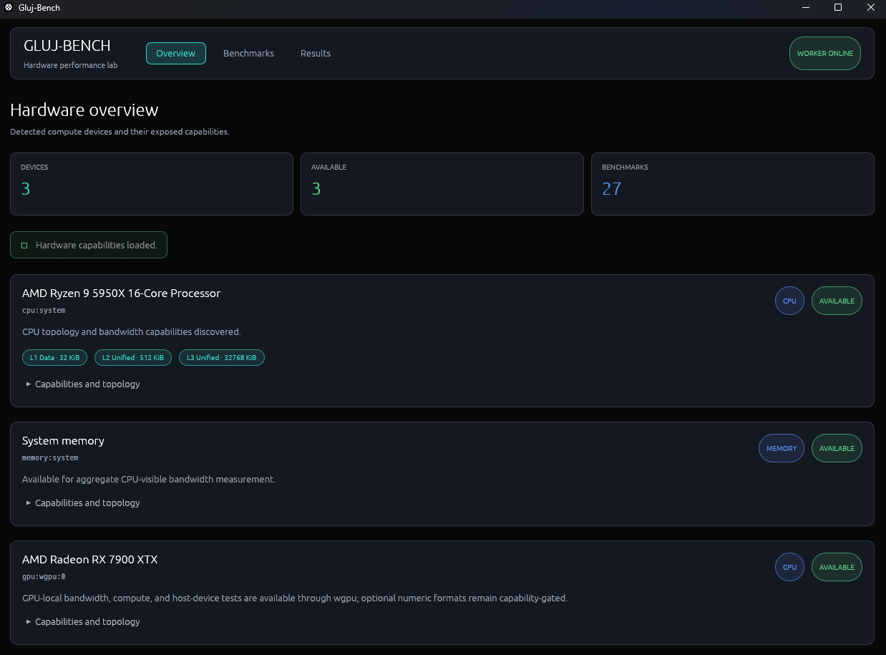
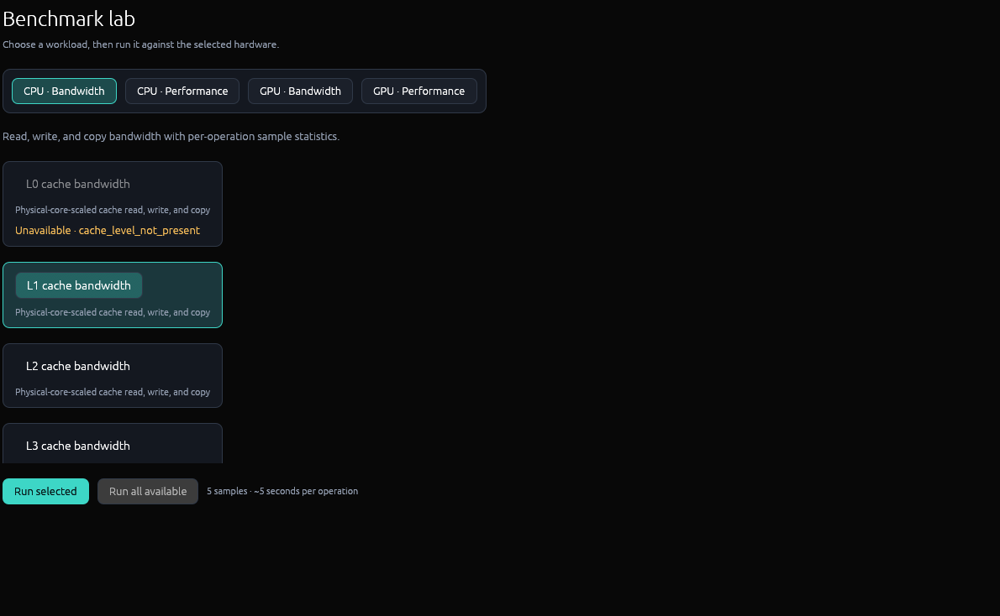
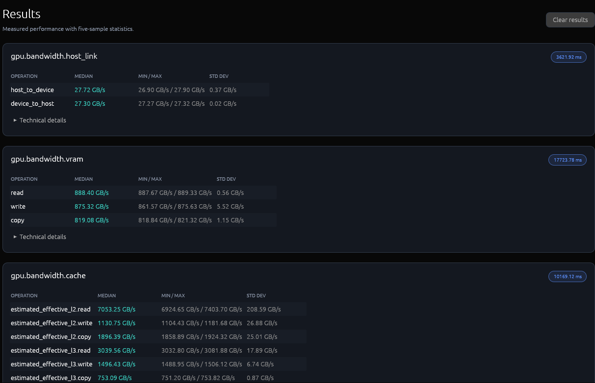

# Gluj-Bench

[](https://github.com/githubdood21/Gluj-Bench/actions/workflows/ci.yml)
[](https://github.com/githubdood21/Gluj-Bench/releases/latest)
[](#system-requirements)
[](LICENSE)

<p align="center">
  <strong>A free, vendor-neutral CPU, GPU, cache, and memory benchmark for Windows.</strong>
</p>

<p align="center">
  
</p>

## TL;DR

Download the latest Windows x64 release, extract it, and run `gluj-bench-ui.exe`. Gluj-Bench measures CPU and GPU compute performance plus cache, RAM, VRAM, and host-to-GPU bandwidth without requiring manufacturer-specific SDKs. It is an early work in progress, so expect bugs and treat every result as an informative measured value—not an exact statement of theoretical hardware capability.

> [!WARNING]
> **Work in progress:** Gluj-Bench is an initial public preview and is not finalized. Bugs, incorrect readings, hangs, and crashes are possible. Benchmark definitions, kernels, metadata, and scores may change before 1.0.

> [!IMPORTANT]
> **Results disclaimer:** This software is provided **as is**, without warranty. Results should be taken with a grain of salt: they reflect what Gluj-Bench measured under a particular workload, software stack, driver, power state, and system configuration. They are not 1:1 replicas of a device's complete capabilities, guaranteed theoretical peaks, or directly interchangeable with results from other benchmark tools.

## About Gluj-Bench

Gluj-Bench is a free, vendor-neutral, AIDA64-like hardware benchmarking tool for Windows. It is designed to test CPU and GPU compute performance together with CPU cache, system RAM, GPU cache, VRAM, and host-to-GPU link bandwidth.

Gluj-Bench provides transparent, reproducible measurements rather than a single unexplained score. GPU performance separates portable vector-shader throughput from capability-gated cooperative-matrix throughput, while GPU bandwidth measures empirically inferred effective L2/L3 regions, cache-separated GPU-local memory, and bidirectional host-device transfers. CPU suites measure aggregate L1-L3 data-cache and system-RAM bandwidth plus pinned integer, floating-point, string, prime-search, codec, POPCNT, AES, and AVX2/FMA workloads. Unsupported capabilities remain visibly disabled rather than producing synthetic results.

Gluj-Bench is independently developed and is not affiliated with or endorsed by FinalWire or AIDA64.

## Screenshots

<table>
  <tr>
    <td align="center">
      <br>
      <sub><strong>CPU benchmark selection and configuration</strong></sub>
    </td>
    <td align="center">
      <br>
      <sub><strong>Detailed GPU benchmark results</strong></sub>
    </td>
  </tr>
</table>

## Download and run

1. Download the Windows x64 ZIP and its `.sha256` file from the [latest GitHub release](https://github.com/githubdood21/Gluj-Bench/releases/latest).
2. Verify the archive in PowerShell:

   ```powershell
   Get-FileHash .\Gluj-Bench-0.1.0-windows-x64.zip -Algorithm SHA256
   Get-Content .\Gluj-Bench-0.1.0-windows-x64.zip.sha256
   ```

3. Extract the entire ZIP and run `gluj-bench-ui.exe`. Keep `gluj-bench-worker.exe` beside it.

Release binaries are currently unsigned, so Windows may display a SmartScreen warning. Only download releases from this repository and verify the published SHA-256 checksum.

## System requirements

- Windows 10 or Windows 11, x64
- A supported x64 CPU for CPU and memory suites
- Current graphics drivers with a compatible Vulkan backend for GPU suites
- Sufficient free RAM and VRAM for the selected bandwidth workloads

GPU support is optional. CPU and RAM benchmarks remain usable when no compatible GPU backend is available.

## Benchmarking safety and repeatability

Gluj-Bench intentionally places sustained load on the CPU, memory, and GPU. Ensure cooling is functioning correctly, avoid unstable overclocks, and stop a run if the system behaves abnormally. Close unnecessary background applications, use a consistent Windows power plan, and allow temperatures to stabilize before comparing results. Scores from different workload versions or metadata should not be treated as directly equivalent.

## Technology

- Rust 2024 workspace managed by Cargo
- `eframe`/`egui` desktop interface using the lightweight Glow renderer
- Separate long-lived benchmark worker process for measurement isolation
- `sysinfo` for portable CPU and memory discovery
- Vulkan through `ash` for authoritative GPU discovery, stable device identity, queue/timestamp capabilities, and cooperative-matrix format enumeration
- Raw Vulkan with embedded SPIR-V for GPU bandwidth, FP16/FP32/FP64 vector benchmarks, and capability-gated FP16/INT8 cooperative-matrix benchmarks
- Versioned newline-delimited JSON for UI-to-worker communication
- LLVM-MinGW Windows toolchain, with no Visual Studio installation required

GPU handling is based on exposed capabilities such as compute and timestamp-query support. There are no manufacturer-specific SDKs or execution paths.

## Workspace layout

The application is split into five Cargo packages:

- `gluj-bench-core` defines devices, benchmarks, results, metrics, cancellation, progress, providers, and the protocol.
- `gluj-bench-cpu` contains optimized CPU topology discovery and bandwidth kernels.
- `gluj-bench-gpu` contains Vulkan capability discovery, empirical cache analysis, GPU kernels, and host-device transfer measurements.
- `gluj-bench-worker` provides hardware discovery, the CLI, and the standard-I/O protocol host.
- `gluj-bench-ui` provides the desktop application and manages the worker as a child process.

The protocol is documented in [docs/protocol.md](docs/protocol.md).

## Windows prerequisites

Install Rust with the official [rustup installer](https://rustup.rs/) or WinGet:

```powershell
winget install --id Rustlang.Rustup
```

Run `rustup-init` if the installer does not start it automatically. The repository's `rust-toolchain.toml` selects the required Rust host and Windows target.

Install the self-contained LLVM-MinGW toolchain:

```powershell
winget install --id MartinStorsjo.LLVM-MinGW.MSVCRT --exact
```

Restart VS Code after installing the prerequisites, then verify:

```powershell
rustc --version
cargo --version
```

The project wrapper locates LLVM-MinGW automatically and builds statically linked application binaries. You do not need to configure a compiler, linker, SDK path, or dependency manager manually.

## Run from VS Code

1. Open the repository folder in VS Code.
2. Install the recommended **rust-analyzer** and **CodeLLDB** extensions.
3. Open **Run and Debug** and select **Gluj-Bench UI (Debug)**.
4. Press `F5`.

Every F5 launch runs the complete debug workspace build first and then starts the UI under CodeLLDB. `Ctrl+Shift+B` runs the same build task.

## Command-line development

Use the wrapper so Cargo receives the correct Windows target, linker, runtime, and static-link settings:

```powershell
powershell -ExecutionPolicy Bypass -File .\scripts\cargo.ps1 build --workspace
powershell -ExecutionPolicy Bypass -File .\scripts\cargo.ps1 test --workspace
powershell -ExecutionPolicy Bypass -File .\scripts\cargo.ps1 clippy --workspace --all-targets -- -D warnings
powershell -ExecutionPolicy Bypass -File .\scripts\cargo.ps1 run -p gluj-bench-ui
```

Debug executables are written to:

```text
target/x86_64-pc-windows-gnullvm/debug/
```

The first build downloads and compiles the dependency graph. Later builds are incremental and substantially faster.

To create the same Windows x64 archive used by GitHub Releases:

```powershell
.\scripts\package-release.ps1 -Version 0.1.0
```

The archive and SHA-256 checksum are written to `dist/`. Maintainer instructions are in [RELEASING.md](RELEASING.md), notable changes in [CHANGELOG.md](CHANGELOG.md), and private vulnerability reporting guidance in [SECURITY.md](SECURITY.md).

## Worker CLI

The worker can be used independently:

```text
gluj-bench-worker devices [--json]
gluj-bench-worker benchmarks [--json]
gluj-bench-worker run <benchmark-id> [--json]
gluj-bench-worker --stdio
```

Human-readable commands write normal output to stdout. With `--json`, stdout contains a versioned protocol response. In `--stdio` mode, stdout is reserved for newline-delimited JSON and diagnostics are written to stderr.

## Current behavior

- CPU, system memory, and compatible GPU devices are discovered at runtime.
- Missing GPU support is nonfatal; CPU and memory remain available.
- GPU devices are evaluated by backend capabilities, not manufacturer identity.
- Duplicate backend views of the same adapter are consolidated and the UI provides an explicit GPU selector. GPU runs pass its `device_id` through protocol configuration.
- GPU cache discovery sends a fixed amount of coalesced traffic through power-of-two working sets from 256 KiB to 512 MiB. A normal boundary requires repeatable samples, a stable preceding plateau, and a sustained 20% drop at two larger sizes; an outermost sustained collapse of at least 50% is retained as a lower-confidence last-level boundary even when the preceding region slopes near capacity.
- Detected cache regions are displayed as **Estimated Effective L2** and **Estimated Effective L3**. They are behavioral inferences, not claims about physical cache topology; capacity intervals, confidence, thresholds, and the complete sweep are attached to result metadata.
- Effective-cache and GPU-local kernels use coalesced 16-byte vector accesses with independent accumulators and sparse checksum writes. Cache reads use four vectors per invocation, streaming VRAM reads use sixty-four across eight dependency chains, streaming writes/copies use sixteen, and write/copy cache kernels retain one vector per invocation to keep small working sets highly parallel. GPU-local memory uses at least 256 MiB and four times the outer inferred cache boundary.
- GPU copy bandwidth reports read-plus-write device-memory traffic for comparison with peak VRAM/cache bandwidth; useful copied payload is exactly half that reported rate and the convention is recorded in result metadata.
- GPU-local operations run a discarded 750 ms sustained preconditioning workload before calibration and sampling so portable power management can raise core and memory clocks. The application does not force a vendor driver clock lock, and results explicitly record that distinction.
- GPU shader benchmarks cover FP16, FP32, and FP64 vector arithmetic. Matrix benchmarks expose dense and sparse FP16, INT8, and FP8 families. Vulkan-reported MxNxK and numeric-type configurations directly gate the raw Vulkan cooperative-matrix runners; formats without a capability-verified path remain visible with their exact reason.
- Precision classes are compared within the same execution domain. In particular, the RX 7900 XTX is specified for equal FP16-vector and FP32-vector peak throughput; its doubled FP16 figure belongs to the separate matrix path.
- Host-to-device and device-to-host tests use a first-touched ring of three preallocated 64 MiB host-visible staging buffers, batched native buffer copies, and CPU wall-clock completion timing. Discrete adapters are marked `probable_pcie`, integrated adapters `shared_memory_or_uma`, and both classifications remain explicit inferences.
- Overview, Benchmarks, and Results screens are present in the UI.
- L1-L3 cache and system-RAM read, write, and copy bandwidth benchmarks run across all discovered physical cores when topology and working-set requirements can be satisfied.
- Per-cache-instance working-set partitioning supports processors with multiple shared last-level caches without relying on manufacturer IDs.
- Cache measurements use 40% of each discovered cache instance, divide that capacity only among cores in the instance's topology mask, and preload disjoint per-core buffers before timing. RAM measurements flush their working cache lines and rotate the sequential starting line before every timed sweep. Buffers are first-touched by their pinned owner core; preparation and cache flushing are excluded from elapsed time.
- Read, write, and copy operations each target 2 seconds by default and report the median of five samples.
- Physical-core workers remain the default. Protocol clients can request `thread_mode=logical_processors` for controlled SMT comparisons; cache capacity is divided between sibling workers so physical-core and logical-processor modes use the same aggregate footprint.
- Cache copy bandwidth follows AIDA64-style read-plus-write traffic accounting; RAM copy continues to report useful payload bandwidth. Result metadata identifies the byte definition explicitly.
- Cache SIMD kernels process eight vectors per iteration. Read kernels maintain eight independent accumulators to avoid serial load dependencies; write and copy kernels issue batched aligned operations to approach the available cache data-path throughput.
- Missing cache levels remain visible and disabled with a capability reason.
- Results include per-operation sample statistics and explicit byte-counting metadata.
- Arithmetic CPU performance results use operation rates: OPS or KOPS below one million, MOPS from one million, and TOPS from one trillion operations per second; raw protocol values remain operations per second. Compression and decompression instead report decimal MB/s because they are byte-throughput workloads. Each result defines exactly what is counted.
- Each performance workload records pinned-thread runnable time and a cache-resident versus large-working-set sensitivity probe where the workload has a data set. The UI reports `compute_bound` or `memory_bandwidth_bound` from that ratio and marks it as an inference. OS thread time cannot observe hardware memory-stall cycles directly, so Gluj-Bench does not present the proxy as a performance-counter measurement.
- CPU performance workers precondition their kernels for 200 ms before synchronized samples. Memory-sensitivity diagnosis uses the ratio of medians from three 250 ms cache-resident samples and three 250 ms large-working-set samples instead of a single short probe.
- Register kernels use eight independent dependency chains to expose available execution throughput. ASCII scanning uses AVX2 when available, and DEFLATE workers reuse compressor/decompressor state and preallocated output buffers so timed samples do not measure repeated allocator setup.
- Arithmetic kernel revision 4 defines a comparison group for INT64, scalar FP32/FP64, AVX2/FMA FP32/FP64, and the single-thread INT64 result. Every member uses eight independent multiply-add chains and counts lane-level multiply and add operations consistently. Workload-specific tests such as AES, primes, and codecs remain outside this comparison group.
- The ASCII workload scans fixed 64-byte records and reports strings per second rather than treating every byte as a generic operation.
- The prime workload repeatedly runs a reusable Sieve of Eratosthenes over integers 2 through 1,000,000, verifies the known 78,498-prime population, and reports primes found per second.

## Planned benchmark work

Future milestones include additional portable codec and cryptographic workloads, broader safely exposed matrix formats, result export, and historical comparison views. Results always identify the operation, numeric data type, workload configuration, sample statistics, elapsed time, unit, and tested device; a generic operation-rate value without that context will not be reported.

## License

Gluj-Bench is available under the [MIT License](LICENSE).
