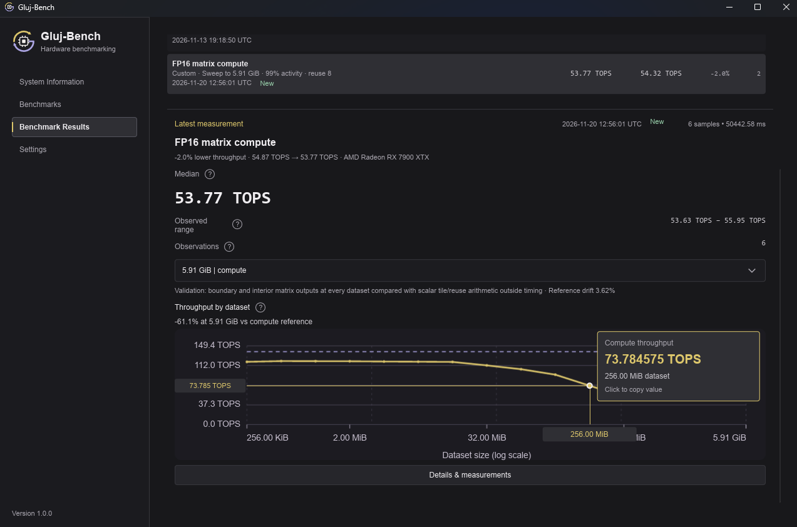
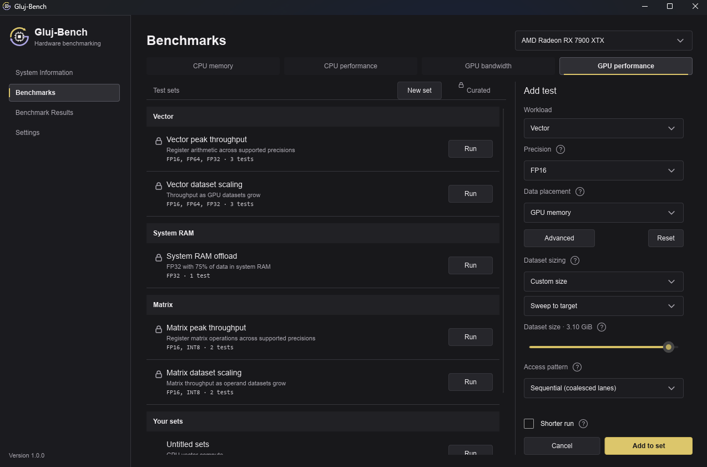
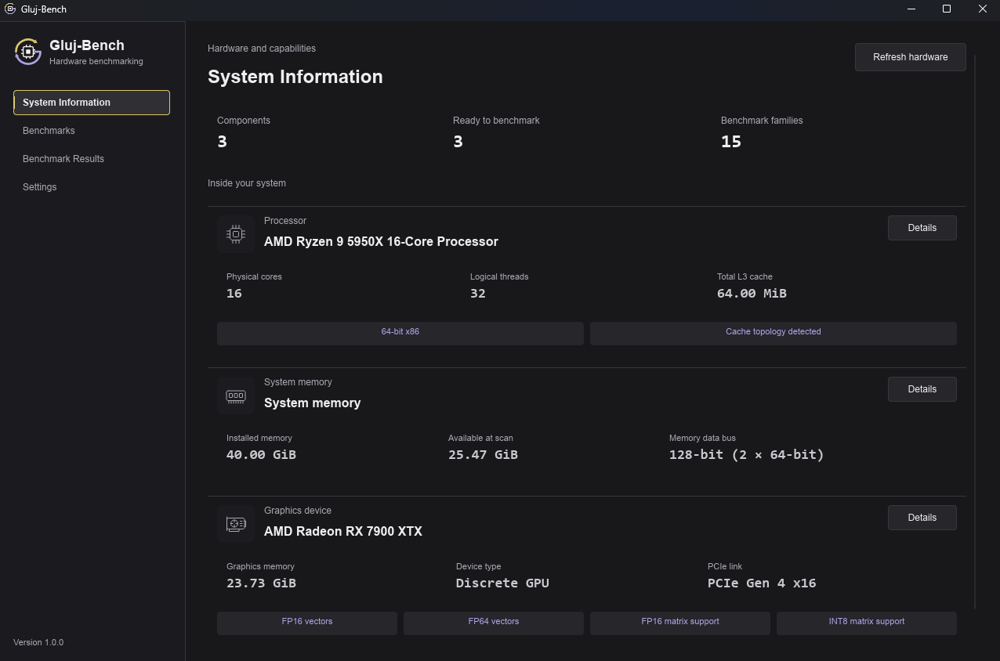

# Gluj-Bench

[](https://github.com/githubdood21/Gluj-Bench/actions/workflows/ci.yml)
[](https://github.com/githubdood21/Gluj-Bench/releases)
[](#requirements)
[](LICENSE)

<p align="center">
  
</p>

**Measured throughput, without an arbitrary hardware score.**

Gluj-Bench is a free, vendor-neutral throughput and latency benchmark for Windows, with curated tests and user-customized test sets. Results report measured work in TOPS, GB/s, nanoseconds per access, or workload-specific rates. The workload, dataset, and hardware configuration stay attached to each result, so you can see what each number represents. There is no combined CPU or GPU score.

**All current benchmarks are synthetic.** They use controlled workloads to measure compute, memory, and transfer behavior under the settings you choose. Real application workloads, including rendering and inference with real LLM models, are planned alongside broader hardware coverage.

## See how throughput scales

<p align="center">
  
</p>

Run a register test, measure one dataset, or sweep progressively larger working sets. The compute graph shows how throughput changes as the workload grows. When a comparable compute reference exists and the largest dataset is slower, the result shows the measured percentage drop. Hover over a point for its value and dataset size, then click it to copy the value.

Repeated observations contribute to a median and an observed range. Variation stays visible in the results. Compare compatible configurations against a saved baseline or inspect the individual observations in Run History.

## Build your own test sets

<p align="center">
  
</p>

- **Curated test sets** provide complete, versioned benchmarks for the selected hardware. Click **Run** to start a set, or select its row to inspect the included tests. Curated definitions stay read-only.
- **User-created test sets** combine individually configured tests. Choose workload, precision, data placement, core count, dataset size, access pattern, and sampling where supported. Add, edit, or remove tests, then save the collection under your own name. The shared GPU adapter selector applies to all sets.
- **Scaling** can use an automatic allocation budget, sweep up to a chosen size, or measure one size. Optional seeded access patterns vary locality and cache turnover. Curated sets use standard access.
- **Shorter run** reduces the sampling budget. The default takes at least six observations per measured condition. Setup, reference measurements, sweeps, and validation add to the total run time.

While a queue is active, **Cancel test** stops the current test and **Stop all tests** clears the rest of the queue.

## What you can measure

| Workload | Measurements |
| --- | --- |
| CPU compute | Scalar and vector arithmetic, blocked FP32 matrix compute, INT64, ASCII scanning, prime sieve, AES, POPCNT, and DEFLATE |
| CPU memory | L1/L2/L3 cache and system RAM read, write, and copy bandwidth, plus dependent-read latency |
| GPU compute | Supported FP16/FP32/FP64 vectors and dense FP16/INT8 cooperative matrices, with register and buffered modes |
| GPU memory | Cache-oriented and streaming VRAM workloads, directional host transfers, and FP32 compute with configurable system-RAM offload |

These are synthetic tests, including the named scanning, compression, and other algorithm workloads. Rendering applications and real LLM models are part of the roadmap, rather than the current test catalogue.

TOPS counts the operations defined by the workload. An FMA counts as one multiply and one add. Compare the same kernel, precision, dataset, and settings. Memory copy summaries report useful payload moved. Read, write, and copy rates are reported separately.

## Get started

1. Download the Windows x64 ZIP from [GitHub Releases](https://github.com/githubdood21/Gluj-Bench/releases).
2. Extract the ZIP into a writable folder and launch `gluj-bench-ui.exe`. Keep `gluj-bench-worker.exe` in the same folder.
3. Open **Benchmarks**, choose a category and hardware, then click **Run** on a curated set or use **New set** to build your own.
4. Open **Benchmark Results** for charts, timestamps, and comparisons. Use **Run history** to inspect saved runs, add notes, or pin a baseline.

The [user guide](docs/user-guide.md) walks through a first run, a custom sweep, and exporting results.

<p align="center">
  
</p>

### Requirements

- Windows x64 and enough available RAM or VRAM for the selected workload.
- Vulkan compute support for GPU tests. CPU and RAM tests are available independently.
- AVX2 and FMA for the corresponding CPU modes. GPU matrix modes require driver-exposed cooperative-matrix support. The app shows availability for the detected hardware.

### Save, share, and move your results

Results and settings are portable. Keep `run-history/`, `results.json`, `settings.json`, and `benchmark-settings.json` when updating or moving the app.

Use **Share results** for a PNG that embeds the checked result summaries by default. Keep the original PNG to preserve its comparison data. For complete run records with raw observations and provenance, use **Run history → Files → Export native JSON**. Imported runs and PNG snapshots can be used as comparison sources.

## Roadmap

Planned directions, not currently available benchmarks:

- **Real application workloads:** rendering, inference with real LLM models, and other tasks that report measured throughput in relevant units, such as rendered frames or generated tokens per second. Workload and model settings will remain part of the result.
- **Multi-GPU and multi-CPU testing:** run multiple GPUs or CPU sockets together, reporting throughput for each device and the group, with memory placement and data movement recorded alongside the measurements.
- **More hardware components:** storage throughput and latency tests, followed by coverage of other components where useful work can be measured clearly.

The same principle will apply throughout: report the work performed and the conditions measured, without reducing different workloads to an arbitrary hardware score. These directions have no committed release dates. See the [backlog](docs/backlog.md) for existing implementation notes.

## Build from source

The desktop UI uses Rust and Slint. A separate worker runs measurements, with Vulkan and embedded SPIR-V for GPU workloads. Build on Windows with Rust 1.95 or later and LLVM-MinGW.

```powershell
.\scripts\cargo.ps1 build --workspace --locked
.\scripts\cargo.ps1 test --workspace --locked
.\scripts\package-release.ps1 -Version 1.0.0
```

Debug binaries are written to `target/x86_64-pc-windows-gnullvm/debug/`. The packaging script writes the release ZIP and SHA-256 checksum to `dist/`. See [Releasing](RELEASING.md) for the full checklist and the [worker protocol](docs/protocol.md) for CLI and integration details.

## Project information

[1.0 release notes](docs/release-1.0.md) · [Changelog](CHANGELOG.md) · [Issues](https://github.com/githubdood21/Gluj-Bench/issues) · [Security](SECURITY.md)

Copyright © 2026 githubdood21. Gluj-Bench is licensed under the [GNU General Public License, version 3 only](LICENSE). See [NOTICE](NOTICE) and the [branding policy](BRANDING.md).
